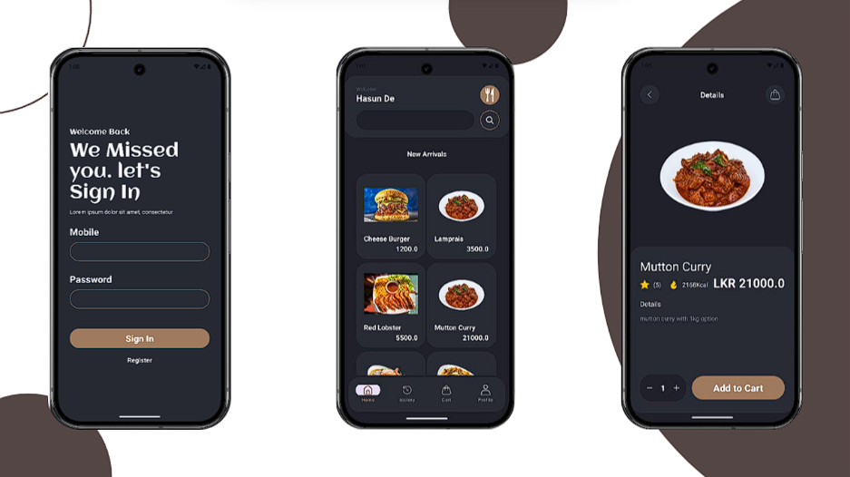
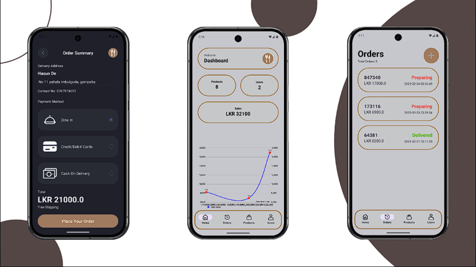

<div align="center">
    
</div>
<br>
<br>
<div align="center">
    
    
    
    
    
    
    
</div>
<br>

## MOMO: Mobile Commerce Application for Food Ordering System

**MOMO** is a **Mobile Commerce (M-Commerce)** application designed to enhance the dining experience for both **customers** and **restaurants**.  
Users can browse menus, place orders, make secure payments, and track deliveries — all from their smartphones.
<br>
<br>

## Key Features

### 👤 Customer Features
- **User-Friendly Interface** – Intuitive navigation for easy ordering.  
- **Browse & Filter Foods** – Explore dishes with images, descriptions, prices, ratings, and nutritional info.  
- **Order Placement** – Add to cart, customize, and confirm orders.  
- **Secure Payment Options** – Supports:
  - Dine-In
  - Card Payment
  - Cash on Delivery  
- **Real-Time Order Tracking** – Track progress from preparation to delivery.  
- **Order History** – View and reorder past items anytime.  

### 🧑‍💼 Admin Features
- **Admin Dashboard** – Manage orders, payments, and reports.  
- **Inventory Management** – Update food items, pricing, and availability.  
- **Sales & Analytics Reports** – Monitor total sales, revenue, and insights.  
- **Employee Management** – Add employees and assign roles efficiently.  
<br>

## Tech Stack

| Component | Technology Used |
|------------|------------------|
| **Mobile App Language** | Java |
| **UI Design** | XML |
| **Framework** | Android SDK |
| **Backend Language** | PHP |
| **Database** | Firebase Realtime Database / SQLite |
| **Hosting** | Firebase / Hostinger |
| **API Integration** | Google Maps API |
| **Payment Gateway** | PayHere |
<br>

## 🧩 Architecture

The MOMO app follows a **client-server architecture**:

- **Client (Android App):** Handles the user interface, order placement, and payment processing.  
- **Server (PHP API):** Manages authentication, order storage, analytics, and data synchronization.  
- **Admin Panel:** Enables staff to monitor and manage all orders and restaurant activities.
<br>

## 💳 Payment Gateway

MOMO integrates with **PayHere**, enabling **secure, fast, and reliable** transactions.

Supported methods:
- VISA / MasterCard  
- Mobile payments  
- Cash on Delivery  
<br>

## 🛠️ Installation

### Prerequisites
- Android Studio (latest version)  
- PHP-enabled server or Firebase setup  
- PayHere API keys  
- Google Maps API key  

### Steps
1. Clone this repository:
   ```bash
   git clone https://github.com/<your-username>/momo-food-ordering.git
   ```
2. Open the project in Android Studio.

3. Configure the API URLs in `config.java`.

4. Add your Firebase and PayHere credentials.

5. Build and run the app on your device or emulator.
<br>

## Screenshots
### 1. Client
<div align="center">
    
</div>
<br>

### 2. Admin
<div align="center">
    
</div>
<br>
<br>

## 🌱 Future Enhancements

- AI-based food recommendations.

- Table reservations for dine-in customers.

- Push notifications for order updates.

- Loyalty & rewards system.
<br>

## Contributing
1. Fork the repo

2. Create a feature branch
   ```bash
   git checkout -b feature/your-feature
   ```

3. Commit changes
   ```bash 
   git commit -m "Add your feature"
   ```

4. Push to the branch 
   ```bash
   git push origin feature/your-feature
   ```

5. Open a Pull Request
<br>

## License
This plugin is open-source and available under the [MIT](./LICENSE). See the LICENSE.md file for details.


